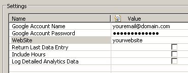

<html xmlns="http://www.w3.org/1999/xhtml">
<head>
    <title>Google Analytics Monitor Plugin</title>
    <meta http-equiv="Content-Type" content="text/html; charset=UTF-8"/>
    <meta http-equiv="X-UA-Compatible" content="IE=EmulateIE8" />
    <meta content="Scroll Wiki Publisher" name="generator"/>
    <link type="text/css" rel="stylesheet" href="css/blueprint/liquid.css" media="screen, projection"/>
    <link type="text/css" rel="stylesheet" href="css/blueprint/print.css" media="print"/>
    <link type="text/css" rel="stylesheet" href="css/content-style.css" media="screen, projection, print"/>
    <link type="text/css" rel="stylesheet" href="css/screen.css" media="screen, projection"/>
    <link type="text/css" rel="stylesheet" href="css/print.css" media="print"/>
</head>
<body>
                <h1>Google Analytics Monitor Plugin</h1>
    

        <h2>Overview</h2>
    

            
                     
            

    

The Google Analytics Monitor plugin enables querying values from any website monitored with Google Analytics.The plugin retrieves values such as PageViews, Vistors, New Visitors, Bounces, Exits, Time on Page and Time on Site. This plugin allows you to view and correlate these values with application or infrastructure measures collected by dynaTrace. Correlating these values allows you to answer questions like: Is the Bounce Rate going up because I have a problem on my landing pages? Do my PageViews go down because of slow performance transactions?    

    

The illustration on the left shows a dashboard that shows results from 4 Google Monitors. 2 Monitors monitor blog.dynatrace.com - 2 monitor community.dynatrace.com. One of these monitors uses DELTA mode - the other always retrieves the latest full data entry.    

    

    

        <h2>Plugin Details</h2>
    

        <table>
<thead class=" "></thead><tfoot class=" "></tfoot><tbody class=" ">    <tr>
            <td rowspan="1" colspan="1">
        

Plug-In Versions    

            </td>
                <td rowspan="1" colspan="1">
        

<a href="attachments_34996231_1_com.dynatrace.diagnostics.plugin.GoogleAnalytics_1.0.0.jar">Google Analytics Plugin (compatible with (dynaTrace 3.5+)</a> <a href="https://community/display/DL/Google+Analytics+FastPack">Google Analytics FastPack with pre-configured Dashboard and System Profile </a>    

            </td>
        </tr>
    <tr>
            <td rowspan="1" colspan="1">
        

Author    

            </td>
                <td rowspan="1" colspan="1">
        

Andreas Grabner (andreas.grabner@dynatrace.com)    

            </td>
        </tr>
    <tr>
            <td rowspan="1" colspan="1">
        

dynaTrace Versions    

            </td>
                <td rowspan="1" colspan="1">
        

dynaTrace 3.5, 4+    

            </td>
        </tr>
    <tr>
            <td rowspan="1" colspan="1">
        

License    

            </td>
                <td rowspan="1" colspan="1">
        

<a href="attachments_5275722_2_dynaTraceBSD.txt">dynaTrace BSD</a>    

            </td>
        </tr>
    <tr>
            <td rowspan="1" colspan="1">
        

Support    

            </td>
                <td rowspan="1" colspan="1">
        

<a href="https://community/display/DL/Support+Levels">Not Supported</a>    

            </td>
        </tr>
    <tr>
            <td rowspan="1" colspan="1">
        

Known Problems    

            </td>
                <td rowspan="1" colspan="1">
        

    

            </td>
        </tr>
    <tr>
            <td rowspan="1" colspan="1">
        

Release History    

            </td>
                <td rowspan="1" colspan="1">
        

2010-07-27 Initial Release    

            </td>
        </tr>
</tbody>        </table>
            

    

    

        <h2>Provided Measures</h2>
    

The following image shows the metrics that the monitor provides:    

    

            
            

    

    

        <h2>Configuration Oracle Monitor</h2>
    

            
            

    

The monitor requires the following configuration settings:    

<ul class=" "><li class=" ">    

Google Account Name: The Google Account that has access to Google Analytics Data    

</li><li class=" ">    

Google Account Password: The Google Account password    

</li><li class=" ">    

Website: The website that you want to monitor. You can monitor multiple websites with a single Google account. Default is to monitor the first registered website    

</li><li class=" ">    

Return Last Data Entry: If true - the last full data entry value is returned as result. If false - the delta value to the previous retrieved value is returned. The Delta allows you to get metrics as they come in. Google provides data as granular as one hour. If you specify Last Data Entry you will always get the current total number of the current hour.    

</li><li class=" ">    

Include Hours: If true - the plugin retrieves values with hourly granularity. This setting only has an impact if you specify Return Last Data Entry = true.    

</li><li class=" ">    

Log Detailed Analytics Data: if true - the monitor will log all retrieved measures from the Google API to the monitor log    

</li></ul>    

    

        <h2>Installation</h2>
    

Import the Plugin into the dynaTrace Server. For details how to do this please refer to the <a href="https://community.dynatrace.com/community/display/DOCDT32/Manage+and+Develop+Plugins#ManageandDevelopPlugins-ManageandDevelopPlugins">dynaTrace  documentation</a>.    

    

    

        <h2>Troubleshooting</h2>
    

When running the Plugin to retrieve Delta values (Return Last Data Entry = false), and the schedule you execute the monitor is to frequent it is possible that there is no new data available from Google Analytics. In this case you may not see values coming in from the monitor on every scheduled monitor interval. Open the Tasks/Monitors Dashlet and check the details of the monitor execution. It will indicate if there was data available or not:    

    

            
            

    

If there are problems with the account credentials or with the web site name please have a look at the monitors log output. Change Log Detailed Analytics Data to true in order to get additional log output    

    

    

        <h2>Feedback</h2>
    

Please provide feedback on this monitor either by commenting on this page or by comments on the <a href="https://community/display/DTFORUM/Community+Plugins+and+Extensions">Community Plugins and Extensions</a>    

    

            

        

        

        

    

</body>
</html>
